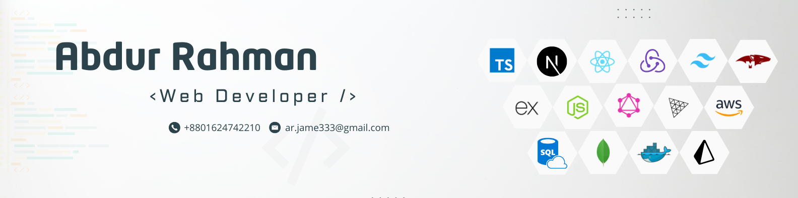

# 💫 About Me:
🔭 I’m currently working on Sneho - a kinship and lineage based social platform 👯 I’m looking to collaborate on - startups 🌱 I’m currently learning System design and cloud architecture

# 💻 Tech Stack:

 
 
 
 
 
 
 
  

 
 
 
 
 

 
 
 
 
 

## 🏆 GitHub Trophies

